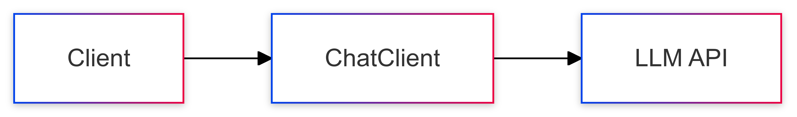

# 01-simple-prompt

The most basic form of LLM interaction. Demonstrates direct prompting without any additional context or processing.

## Key Concepts
- Basic prompt construction
- Direct LLM querying
- Simple response handling

## Usage Examples Per Programming language
### Java
```java
String response = chatClient.prompt("What are the AI components?")
                            .call()
                            .content();
```

### Python
```python
client = OpenAI(api_key=api_key)
response = client.responses.create(
    model="gpt-4.1",
    input="What are the AI components?"
)
```

### TypeScript
```typescript 
const openai = new OpenAI();
const response = await openai.responses.create({
    model: 'gpt-4.1',
    input: "What are the AI components?"
});
```

## Sequence Diagram
