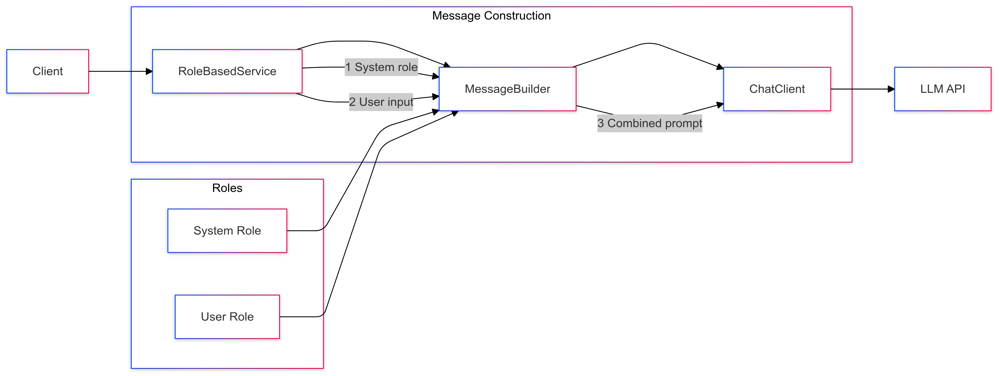

# 02-prompt-with-ai-role

Introduces role-based prompting using system and user messages.

## Key Concepts
- System messages
- User messages
- Role-based interactions
- Persona definition

## Usage Examples Per Programming language
### Java
```java
var messages = List.of(
        new SystemMessage("Act as an experienced AI trainer"),
        new UserMessage("What are the relationships between AI, ML, DL and NLP?")
);
String response = chatClient.prompt(new Prompt(messages));
```

### Python
```python
client = OpenAI(api_key=api_key)
response = client.chat.completions.create(
    model="gpt-4.1",
    messages=[
          {"role": "system", "content": "Act as an experienced AI trainer"},
          {"role": "user", "content": "What are the relationships between AI, ML, DL and NLP?"}
    ]
)
```

### TypeScript
```typescript 
const openai = new OpenAI();
const response = await openai.chat.completions.create({
    model: usedModel,
    messages: [
        {"role": "system", "content": "Act as an experienced AI trainer"},
        {"role": "user", "content": "What are the relationships between AI, ML, DL and NLP?"}
    ]
});
```

## Sequence Diagram
