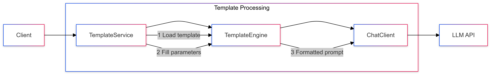

# 03-prompt-with-template

Demonstrates using a simple template, to structure the prompts consistently

## Key Concepts
- String templates
- Parameter substitution
- Formatted prompts

## Usage Examples Per Programming language
```java
PromptTemplate promptTemplate = new PromptTemplate("Tell us a {adjective} joke about {topic}");
Prompt prompt = promptTemplate.create(Map.of());
String response = chatClient.prompt(prompt)
                            .call()
                            .content();
```

## Sequence Diagram
